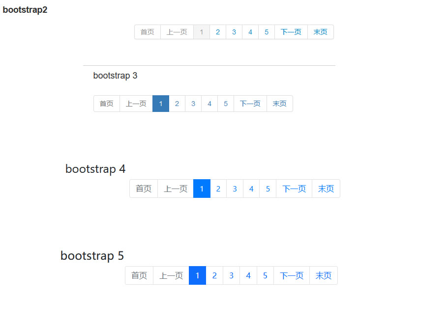

# 一款基于Bootstrap的js分页插件bootstrap-paginator使用实例

<table cellspacing="0" cellpadding="0" border="0">
  <thead>
  <tr>
  <td>
  
<strong>参数名</strong>

  </td>
  <td>
  
<strong>数据类型</strong>

  </td>
  <td>
  
<strong>默认值</strong>

  </td>
  <td>
  
<strong>描述</strong>

  </td>
  </tr>
  </thead>
  <tbody>
  
  <tr>
  <td>
  
bootstrapVersion

  </td>
  <td>
  
number

  </td>
  <td>
  
2

  </td>
  <td>
  
搭配使用的Bootstrap版本，2.X&nbsp;的&nbsp;分页必须使用div元素，3.X, 4.X, 5.X分页的必须使用ul元素。请注意与所使用的bootstrap版本对应上。

  </td>
  </tr>
  <tr>
  <td>
  
size

  </td>
  <td>
  
string

  </td>
  <td>
  
&nbsp;&nbsp;"normal"&nbsp; &nbsp;

  </td>
  <td>
  
设置控件的显示大小，是个字符串. 允许的值:&nbsp;<em>mini</em>,&nbsp;<em>small</em>,&nbsp;<em>normal</em>,<em>large</em><em>。</em>值：mini版的、小号的、正常的、大号的。

  </td>
  </tr>
  <tr>
  <td>
  
alignment

  </td>
  <td>
  
string

  </td>
  <td>
  
&nbsp;"left"

  </td>
  <td>
  
设置控件的对齐方式，是个字符串，&nbsp;允许的值用：&nbsp;<em>left</em>,&nbsp;<em>center</em>&nbsp;and<em>right</em>. 即：左对齐、居中对齐、右对齐。

  </td>
  </tr>
  <tr>
  <td>
  
itemContainerClass

  </td>
  <td>
  
function

  </td>
  <td>
  
&nbsp;

  </td>
  <td>
  
该参数接收一个函数，返回一个字符串，该字符串是一个我们自定义的class类样式。当控件内的每个操纵按钮被渲染(render)时，都会调用该函数，

  
同时把有关该按钮的信息作为参数传入。参数：<strong><em>type</em></strong>,<strong><em>page</em></strong>,&nbsp;<strong><em>current</em></strong>&nbsp;。<strong><em>type</em></strong>为该控件的操作按钮的类型，如上图所示的五种类型：first、prev、page、next、last。

  
<strong><em>page</em></strong>为该按钮所属第几页。<strong><em>current</em></strong>&nbsp;指示整个控件的当前页是第几页。

  </td>
  </tr>
  <tr>
  <td>
  
currentPage

  </td>
  <td>
  
number

  </td>
  <td>
  
1

  </td>
  <td>
  
设置当前页.

  </td>
  </tr>
  <tr>
  <td>
  
numberOfPages

  </td>
  <td>
  
number

  </td>
  <td>
  
5

  </td>
  <td>
  
设置控件显示的页码数.即：类型为"page"的操作按钮的数量。

  </td>
  </tr>
  <tr>
  <td>
  
totalPages

  </td>
  <td>
  
number

  </td>
  <td>
  
1

  </td>
  <td>
  
设置总页数.

  </td>
  </tr>
  <tr>
  <td>
  
pageUrl

  </td>
  <td>
  
function

  </td>
  <td>
  
&nbsp;

  </td>
  <td>
  
实际上，控件内的每个操作按钮最终会被渲染成超链接，该参数的作用就是设置超链接的链接地址。该参数是个函数，参数为：<strong><em>type</em></strong>,<strong><em>page</em></strong>,&nbsp;<strong><em>current</em></strong><strong><em>。</em></strong>

  
这样我们就可以通过这个函数为每个操作按钮动态设置链接地址。如："http://example.com/list/page/"+page

  </td>
  </tr>
  <tr>
  <td>
  
shouldShowPage

  </td>
  <td>
  
boolean/function

  </td>
  <td>
  
true

  </td>
  <td>
  
该参数用于设置某个操作按钮是否显示，可是个布尔值也可是个函数。当为true时，显示。当为false时，不显示。如果该参数是个函数，需要返回个布尔值，

  
通过这个返回值判断是否显示。函数有3个参数:&nbsp;<strong><em>type</em></strong>,&nbsp;<strong><em>page</em></strong>,&nbsp;<strong><em>current</em></strong><strong><em>。</em></strong>使用函数的好处是，可以对每个操作按钮进行显示控制。

  </td>
  </tr>
  <tr>
  <td>
  
itemTexts

  </td>
  <td>
  
function

  </td>
  <td>
  
&nbsp;

  </td>
  <td>
  
控制每个操作按钮的显示文字。是个函数，有3个参数:&nbsp;<strong><em>type</em></strong>,&nbsp;<strong><em>page</em></strong>,&nbsp;<strong><em>current</em></strong><strong><em>。</em></strong>通过这个参数我们就可以将操作按钮上的英文改为中文，

  
如first--&gt;首页，last--&gt;尾页。

  </td>
  </tr>
  <tr>
  <td>
  
tooltipTitles

  </td>
  <td>
  
function

  </td>
  <td>
  
&nbsp;

  </td>
  <td>
  

  不可用
  </td>
  </tr>
  <tr>
  <td>
  
useBootstrapTooltip

  </td>
  <td>
  
boolean

  </td>
  <td>
  
false

  </td>
  <td>
  
设置是否使用Bootstrap内置的tooltip。 true是使用，false是不使用,默认是不使用。

  
注意：如果使用，则需要引入bootstrap-tooltip.js插件。

  </td>
  </tr>
  <tr>
  <td>
  
bootstrapTooltipOptions

  </td>
  <td>
  
object

  </td>
  <td>
  
&nbsp;

  </td>
  <td>
  
&nbsp;&nbsp;&nbsp;&nbsp;Default:

  
&nbsp;&nbsp;&nbsp;&nbsp;{

  
&nbsp;&nbsp;&nbsp;&nbsp;&nbsp;&nbsp;&nbsp;&nbsp;animation:&nbsp;true,

  
&nbsp;&nbsp;&nbsp;&nbsp;&nbsp;&nbsp;&nbsp;&nbsp;html:&nbsp;true,

  
&nbsp;&nbsp;&nbsp;&nbsp;&nbsp;&nbsp;&nbsp;&nbsp;placement:&nbsp;'top',

  
&nbsp;&nbsp;&nbsp;&nbsp;&nbsp;&nbsp;&nbsp;&nbsp;selector:&nbsp;false,

  
&nbsp;&nbsp;&nbsp;&nbsp;&nbsp;&nbsp;&nbsp;&nbsp;title:&nbsp;"",

  
&nbsp;&nbsp;&nbsp;&nbsp;&nbsp;&nbsp;&nbsp;&nbsp;container:&nbsp;false&nbsp;}

  
该参数是个js对象。当参数useBootstrapTooltip为true时，会将该对象传给Bootstrap的bootstrap-tooltip.js插件。

  </td>
  </tr>
  <tr>
  <td>
  
onPageClicked

  </td>
  <td>
  
function

    </td>
  <td>
  
&nbsp;

  </td>
  <td>
  
为操作按钮绑定click事件。回调函数的参数：<strong><em>event</em></strong>,&nbsp;<strong><em>originalEvent</em></strong>,&nbsp;<strong><em>type</em></strong>,<strong><em>page</em></strong><strong><em>。</em></strong>

  </td>
  </tr>
  <tr>
  <td>
  
onPageChanged

  </td>
  <td>
  
function

  </td>
  <td>
  
&nbsp;

  </td>
  <td>
  
为操作按钮绑定页码改变事件，回调函数的参数：<strong><em>event</em></strong>,&nbsp;<strong><em>oldPage</em></strong>,&nbsp;<strong><em>newPage</em></strong><strong><em>。</em></strong>

  </td>
  </tr>
  </tbody>
  </table>

# 公共命令：

## 另外该插件还提供了几个公共的命令，可以通过如下方法调用，如：$('#example').bootstrapPaginator("show",3) 调用show命令、$('#example').bootstrapPaginator("getPages") 调用getPages命令。

<table cellspacing="0" cellpadding="0" border="0">
<tbody>
<tr>
<td>

<strong>命令名</strong>

</td>
<td>

<strong>参数</strong>

</td>
<td>

<strong>返回值</strong>

</td>
<td>

<strong>描述</strong>

</td>
</tr>
<tr>
<td>

show

</td>
<td>

&nbsp;&nbsp;page &nbsp;

</td>
<td>

&nbsp;

</td>
<td>

<strong>show</strong>命令用于直接跳转到特定的page，与直接点击操作按钮的效果是一样的。使用方法，

如：$('#example').bootstrapPaginator("show",3)&nbsp;直接跳转到第3页，

$('#example').bootstrapPaginator("show",100)直接跳转到100页。&nbsp;

</td>
</tr>
<tr>
<td>

showFirst

</td>
<td>

&nbsp;

</td>
<td>

&nbsp;

</td>
<td>

<strong>showFirst</strong>&nbsp;命令用于直接跳转到首页，与点击first按钮相同。使用方法：$('#example').bootstrapPaginator("showFirst")&nbsp;

</td>
</tr>
<tr>
<td>

showPrevious

</td>
<td>

&nbsp;

</td>
<td>

&nbsp;

</td>
<td>

<strong>showPrevious</strong>&nbsp;命令用于直接跳转到上一页。使用方法：$('#example').bootstrapPaginator("showPrevious")&nbsp;

</td>
</tr>
<tr>
<td>

showNext

</td>
<td>

&nbsp;

</td>
<td>

&nbsp;

</td>
<td>

<strong>showNext</strong>命令用于直接跳转到下一页。

</td>
</tr>
<tr>
<td>

showLast

</td>
<td>

&nbsp;

</td>
<td>

&nbsp;

</td>
<td>

<strong>showLast</strong>&nbsp;命令用于直接跳转到上一页。

</td>
</tr>
<tr>
<td>

getPages

</td>
<td>

&nbsp;

</td>
<td>

<em>&nbsp;&nbsp;&nbsp;object&nbsp;&nbsp;</em>

</td>
<td>

<strong>getPages</strong>命令用于返回当前控件中显示的页码，以数组形式返回。使用方法：var arra =&nbsp;$('#example').bootstrapPaginator("getPages")&nbsp;

</td>
</tr>
<tr>
<td>

setOptions

</td>
<td>

<em>object</em>

</td>
<td>

&nbsp;

</td>
<td>

<strong>setOptions&nbsp;</strong>命令用于重新设置参数，使用方法：$('#example').bootstrapPaginator("setOptions",newoptions)

</td>
</tr>
</tbody>
</table>

# 事件Events：
## Bootstrap Paginator 提供了俩个事件：page-clicked和page-changed。这俩个事件作为参数使用，分别对应onPageClicked和onPageChanged。

  <table cellspacing="0" cellpadding="0" border="0">
<tbody>
<tr>
<td>

<strong>事件名</strong>

</td>
<td>

<strong>回调函数</strong>

</td>
<td>

<strong>描述</strong>

</td>
</tr>
<tr>
<td>

page-clicked

</td>
<td>

function(<em>event</em>,&nbsp;<em>originalEvent</em>,&nbsp;<em>type</em>,&nbsp;<em>page</em>)

</td>
<td>

同上文。另外，参数<em>event</em>,&nbsp;<em>originalEvent</em><em>是俩个</em><em>jquery</em><em>事件对象，可参考</em><em>jquery</em><em>相关文档</em>

</td>
</tr>
<tr>
<td>

page-changed

</td>
<td>

function(<em>event</em>,&nbsp;<em>oldPage</em>,&nbsp;<em>newPage</em>)

</td>
<td>

同上文

</td>
</tr>
</tbody>
</table>
